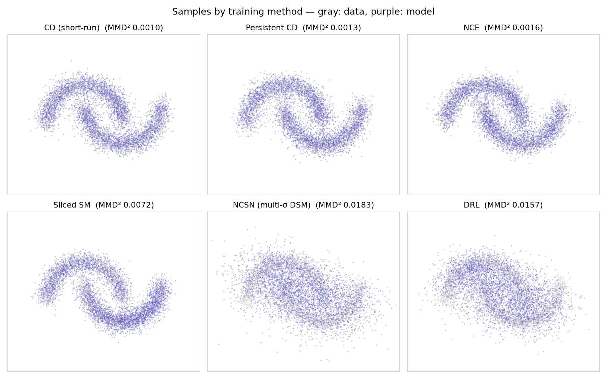

# Benchmarks

Every training method in the library, trained on the same two-moons data and
scored with the library's own evaluation stack — `frechet_distance` and
`mmd` between test data and 4000 model samples, test log-likelihood
**bracketed** by forward and reverse AIS, and wall-clock training time
(M-series MacBook CPU).

Reproduce with:

```bash
python examples/benchmark_losses.py
```

| Method | FD ↓ | MMD² (bw 0.3) ↓ | Test log-lik (nats) | Train time |
|---|---|---|---|---|
| CD (short-run) | 0.002 | 0.0010 | [-1.16, -0.80] | 71 s |
| Persistent CD | 0.008 | 0.0013 | [-1.12, -1.11] | 70 s |
| NCE | 0.002 | 0.0016 | [-1.04, -0.92] | 6 s |
| Sliced SM | 0.038 | 0.0072 | [-1.24, -1.16] | 7 s |
| NCSN (multi-σ DSM) | 0.000 | 0.0183 | [-1.77, -1.73] | 5 s |
| DRL | 0.003 | 0.0157 | [-1.91, -1.88] | 53 s |



## Reading the results

- **FD and MMD disagree — that's the point.** The noise-conditional methods
  (NCSN, DRL) produce samples that match the data's mean and covariance
  almost perfectly (tiny FD) but are visibly *blurrier* than the data; MMD at
  a structure-scale bandwidth (0.3) exposes exactly that. One number is never
  enough — look at samples.
- **Why the blur is structural:** annealed and recovery sampling stop at the
  smallest ladder level, so their output is the σ_L-smoothed marginal — and
  the σ-conditional energy is only as sharp at σ_L as training made it.
  Shrinking σ_L and lengthening the ladder tightens the samples at the cost
  of more sampling steps.
- **The log-likelihood is an interval, not a number.** `log p = -E - log Z`,
  so the forward/reverse AIS bracket on log Z flips into a bracket on
  likelihood (endpoints sorted — near convergence the two estimates can cross
  within noise). A wide interval means AIS found the landscape hard to anneal
  through — itself a diagnostic.
- **Score matching trains fast but samples poorly from multimodal energies.**
  SSM never sees negatives, so nothing shapes the energy *between* the modes;
  long-run Langevin then mixes badly. This is the textbook failure mode, and
  part of why the NCSN/DRL ladder approaches exist.
- Numbers move a little run to run (MCMC training is stochastic); the
  *ordering* is stable.
