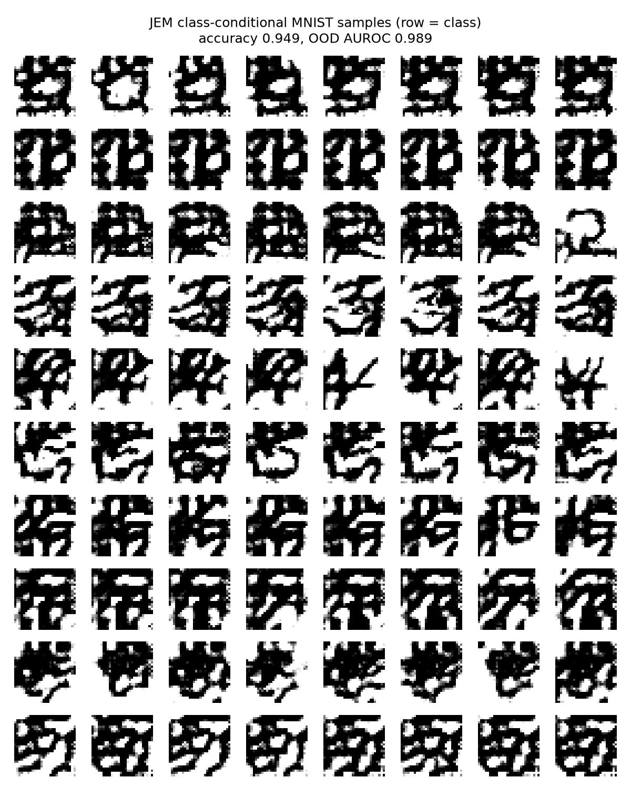
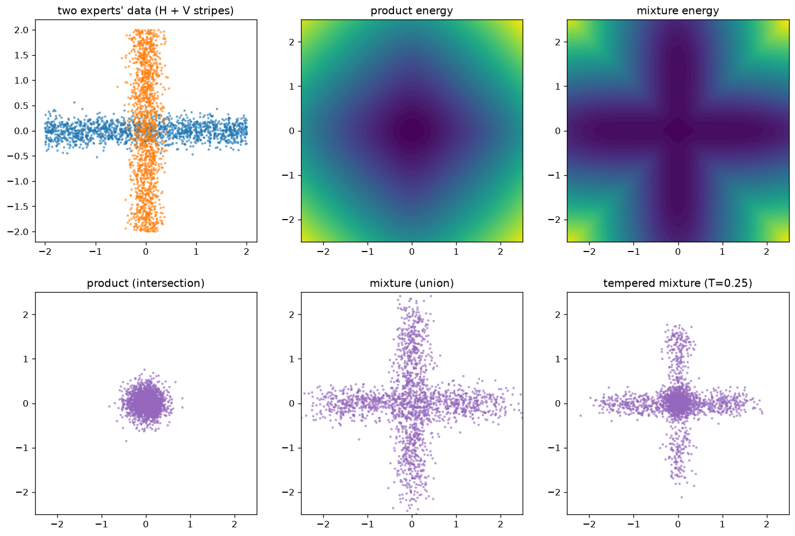
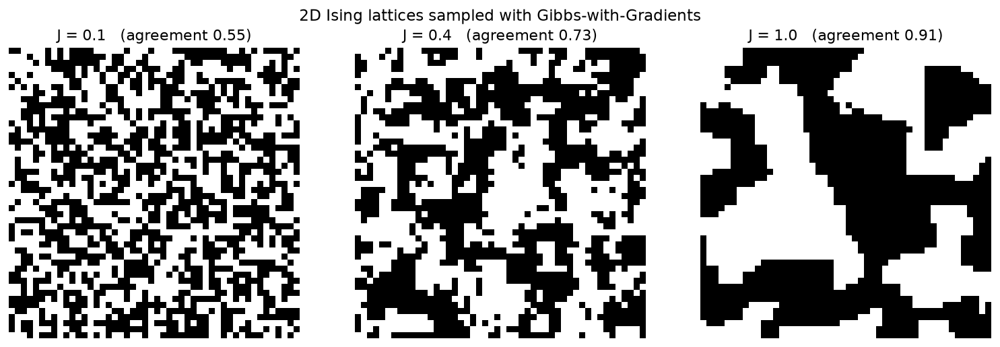
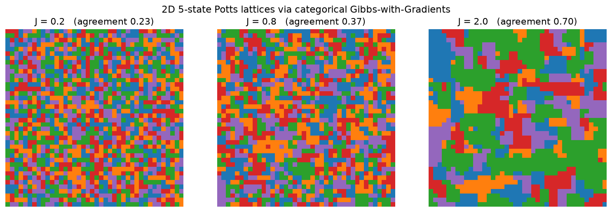
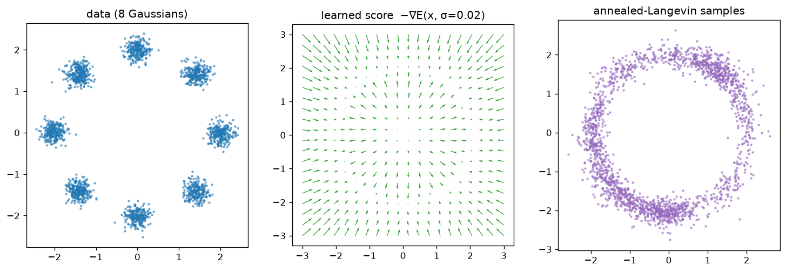

# Examples

The examples live in [`examples/`](https://github.com/davidkhjo/ebm-pytorch/tree/main/examples);
the 2D ones run on CPU in a few minutes, the MNIST ones want MPS/CUDA.

## Two moons with persistent CD

`examples/train_two_moons.py` — the canonical smoke test. An `MLPEnergy` is
trained with `ContrastiveDivergence` + `ReplayBuffer` + `energy_reg=0.1`,
then sampled with long-run Langevin:


Left to right: data, the learned energy landscape (low energy on the moons),
and fresh samples from noise. The pieces that matter:

```python
energy = ebm.nets.MLPEnergy(dim=2, hidden=(128, 128))
loss_fn = ebm.ContrastiveDivergence(
    ebm.LangevinDynamics(step_size=1e-2, steps=60),
    buffer=ebm.ReplayBuffer(8192, (2,)),
    energy_reg=0.1,       # without this the energies drift to ±500 and diverge
)
ebm.Trainer(energy, loss_fn, lr=1e-3).fit(ebm.datasets.two_moons(8192), steps=6000)
```

## JEM: classify and generate with one network

`examples/train_jem.py` — a 3-layer MLP classifier on labeled two-moons,
trained jointly with `JEMLoss` (cross-entropy + contrastive divergence on the
marginal energy). It reaches 100% accuracy *and* generates each moon on
demand:


```python
energy = ebm.ClassifierEnergy(my_2_class_mlp)
loss_fn = ebm.JEMLoss(ebm.ContrastiveDivergence(sampler, buffer=buffer, energy_reg=0.1))
trainer.fit((x, y), steps=4000, batch_size=256)   # supervised batches

moon_0 = sampler.sample(energy.condition(0), noise)  # class-conditional samples
```

The EMA weights (`trainer.ema.module`) give visibly cleaner samples than the
raw weights — use them for anything you show to humans.

## MNIST: the IGEBM short-run recipe

`examples/train_mnist.py` — an image-scale EBM with no extra dependencies:
`ebm.datasets.mnist()` downloads and parses the raw IDX files itself. A small
`ConvEnergy` is trained with persistent CD using the practitioner constants
from Du & Mordatch (2019), and digits are generated by the *same* short-run
dynamics from fresh noise:


```python
sampler = ebm.LangevinDynamics(
    step_size=10.0, noise_scale=0.005, grad_clip=0.01, steps=60, clamp=(-1, 1)
)
loss_fn = ebm.ContrastiveDivergence(
    sampler,
    buffer=ebm.ReplayBuffer(10_000, (1, 28, 28), reinit_prob=0.05, init_fn=uniform_init),
    energy_reg=1.0,
)
# generate with the training dynamics:
samples = sampler.sample(energy, uniform_init((64, 1, 28, 28)), steps=300)
```

Why this recipe and not recovery likelihood for a small-budget image demo?
Short-run EBMs train the *exact* process used for generation (noise → data in
60 steps), so a few thousand updates suffice. DRL's negatives start at the
tether point near data — its generation path from pure noise is never
exercised during training and only becomes reliable at paper-scale budgets.
See the note in [Training methods](training.md).

## JEM at image scale: classify, detect OOD, and draw digits

`examples/train_mnist_jem.py` — the previous two recipes combined: a
`ConvClassifier` wrapped in `ClassifierEnergy` and trained with `JEMLoss`
using the exact IGEBM sampler constants above. One network then does three
jobs — classifies test digits (~95% accuracy), flags Fashion-MNIST images as
out-of-distribution by their energy (~0.99 AUROC — the headline JEM
capability; `ebm.datasets.fashion_mnist` is the classic OOD counterpart from
Grathwohl et al., 2020), and draws digits of a *requested* class:



Read the figure honestly: classification and OOD are strong at this budget,
and each row (one class) is visibly distinct — the conditional signal works —
but the samples themselves stay rough. Crisp digit *generation* is the
expensive part, the same budget lesson as the unconditional example above.

```python
energy = ebm.ClassifierEnergy(
    ebm.nets.ConvClassifier(num_classes=10, in_channels=1, image_size=28, channels=(32, 64, 128))
)
loss_fn = ebm.JEMLoss(
    ebm.ContrastiveDivergence(sampler, buffer=buffer, energy_reg=1.0),
    conditional_negatives=True,   # sample negatives per random class, JEM-style
)
trainer.fit((x, y), steps=8000, batch_size=128)          # supervised batches

sevens = sampler.sample(energy.condition(7), noise, steps=300)   # row-on-demand
auroc = ebm.eval.ood_auroc(energy, mnist_test, fashion_test)     # energy as OOD score
```

`conditional_negatives=True` matters at image scale: with plain marginal CD,
sampling a single logit at generation time explores directions CD never
trained, and `condition(k)` produces adversarial-looking textures instead of
digits — a classifier's individual logits are easy to push up off-manifold.
Steering each training chain by a random class (as the JEM reference code
does) trains exactly the per-class paths that conditional generation uses.
The loss terms stay marginal, so nothing else changes.

## Composing energies: product, mixture, tempering

`examples/train_composition.py` — trains two experts on crossing stripes (one
horizontal, one vertical), then combines them *without retraining*. Because
`p(x) ∝ exp(-E(x))`, arithmetic on energies is arithmetic on densities, and
every composition is itself an energy the same `LangevinDynamics` can sample:



```python
product = ebm.SumEnergy(expert_h, expert_v)         # p_H · p_V  -> intersection
mixture = ebm.MixtureEnergy(expert_h, expert_v)     # p_H + p_V  -> union
sharp   = ebm.TemperedEnergy(mixture, temperature=0.25)   # sharpen the union
samples = ebm.LangevinDynamics(step_size=0.01, steps=500).sample(product, noise)
```

The product concentrates mass where **both** experts agree (the blob where the
stripes cross); the mixture covers **either** (the full plus-shape); tempering
sharpens toward the highest-density overlap. See [Composing energies](composition.md)
for the full algebra.

## Discrete EBMs: a 2D Ising lattice

`examples/train_ising.py` — the library's *discrete* side. `GibbsWithGradients`
is an exact Metropolis-Hastings sampler for binary data `x ∈ {0,1}^D`, and
`nets.IsingEnergy` is a 2D nearest-neighbor lattice energy
`E(x) = -J Σ_⟨i,j⟩ s_i s_j` (spins `s = 2x − 1`). Starting from a random binary
lattice and running the sampler at three coupling strengths reproduces the
ferromagnetic phase behavior — disorder at weak coupling, large aligned domains
at strong coupling (neighbor agreement 0.55 → 0.73 → 0.91):



```python
energy = ebm.nets.IsingEnergy(coupling=1.0)
x0 = torch.bernoulli(torch.full((4, 48, 48), 0.5))       # random binary lattice
x = ebm.GibbsWithGradients(steps=3000).sample(energy, x0)
```

`IsingEnergy(..., learn_coupling=True)` makes `J` a trainable parameter, so the
same discrete `ContrastiveDivergence` + `ReplayBuffer` recipe can *recover* a
coupling from data.

## Categorical EBMs: a Potts lattice

`examples/train_potts.py` — the categorical counterpart.
`CategoricalGibbsWithGradients` samples one-hot data `(B, H, W, K)`, and
`nets.PottsEnergy` is the K-color generalization of `IsingEnergy`:
`E(x) = -J Σ_⟨i,j⟩ 1[c_i = c_j]`, where the indicator is the dot product of
adjacent one-hot rows. A random 5-color speckle (neighbor agreement ≈ 1/K)
condenses into same-color domains as the coupling grows (0.23 → 0.37 → 0.70):



```python
energy = ebm.nets.PottsEnergy(coupling=2.0)
x0 = torch.nn.functional.one_hot(torch.randint(5, (1, 40, 40)), 5).float()
x = ebm.CategoricalGibbsWithGradients(steps=4000).sample(energy, x0)
colors = x.argmax(-1)                                     # (1, 40, 40) category ids
```

## Score-based generation with NCSN

`examples/train_ncsn.py` — a standalone tour of the noise-conditional stack
(Song & Ermon, 2019). A `NoiseConditionalMLPEnergy` is trained with
`MultiSigmaDenoisingScoreMatching` over a geometric σ ladder — no MCMC, no
negatives — and sampled with `AnnealedLangevinDynamics`, running Langevin down
the ladder from the largest σ to the smallest:



```python
sigmas = ebm.geometric_sigmas(2.0, 0.02, 20)
net = ebm.nets.NoiseConditionalMLPEnergy(dim=2)
ebm.Trainer(net, ebm.MultiSigmaDenoisingScoreMatching(sigmas)).fit(data, steps=8000)

sampler = ebm.AnnealedLangevinDynamics(sigmas, step_size=4e-3, steps_per_sigma=200)
samples = sampler.sample(net, torch.randn(2000, 2))
```

The middle panel is the learned score `−∇E(x, σ_min)` pointing back toward the
data. On the eight-Gaussians target the annealed sampler **covers all eight
modes** (density concentrating at each), where plain single-σ Langevin tends to
collapse onto only a few — annealing from a near-Gaussian large-σ landscape is
what lets chains cross the low-density gaps between modes.
