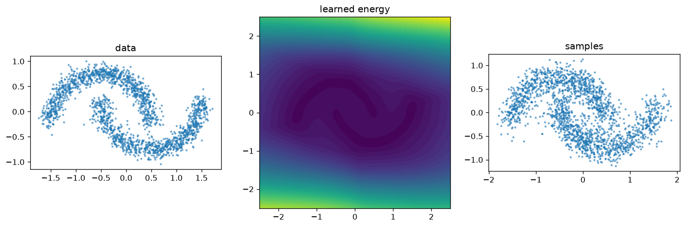
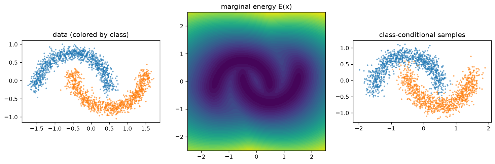
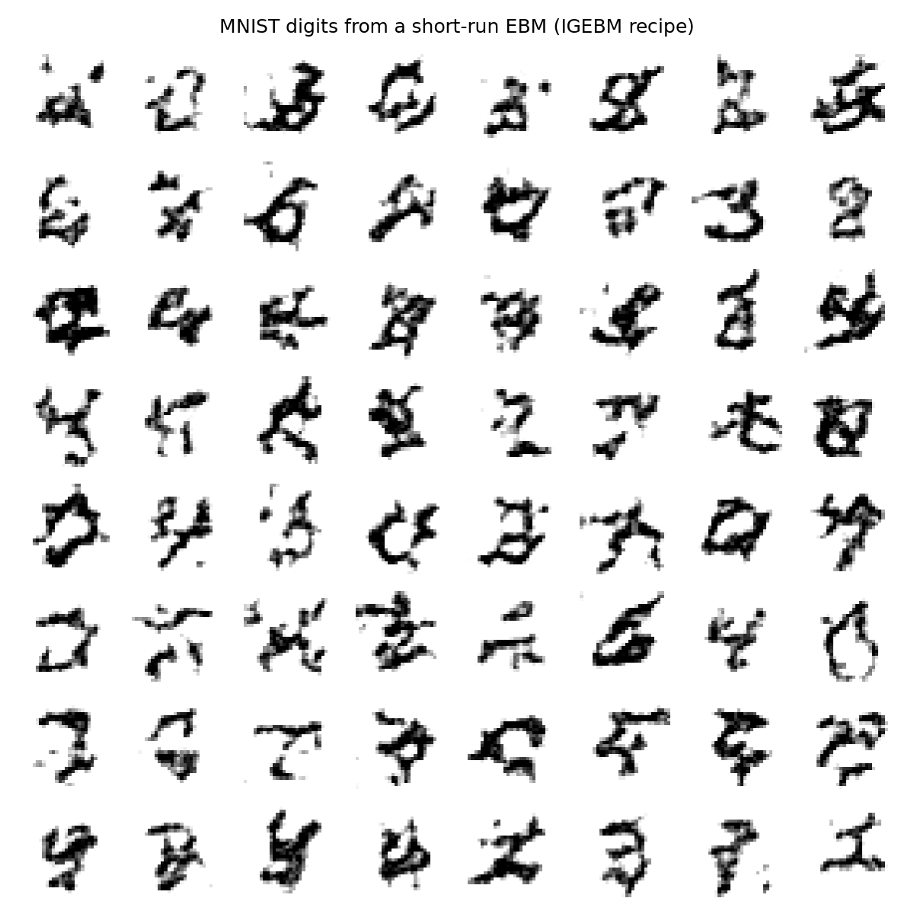

# Examples

Both examples live in [`examples/`](https://github.com/dkjo8/ebm-pytorch/tree/main/examples)
and run on CPU in a few minutes.

## Two moons with persistent CD

`examples/train_two_moons.py` — the canonical smoke test. An `MLPEnergy` is
trained with `ContrastiveDivergence` + `ReplayBuffer` + `energy_reg=0.1`,
then sampled with long-run Langevin:



Left to right: data, the learned energy landscape (low energy on the moons),
and fresh samples from noise. The pieces that matter:

```python
energy = ebm.nets.MLPEnergy(dim=2, hidden=(128, 128))
loss_fn = ebm.ContrastiveDivergence(
    ebm.LangevinDynamics(step_size=1e-2, steps=60),
    buffer=ebm.ReplayBuffer(8192, (2,)),
    energy_reg=0.1,       # without this the energies drift to ±500 and diverge
)
ebm.Trainer(energy, loss_fn, lr=1e-3).fit(ebm.datasets.two_moons(8192), steps=6000)
```

## JEM: classify and generate with one network

`examples/train_jem.py` — a 3-layer MLP classifier on labeled two-moons,
trained jointly with `JEMLoss` (cross-entropy + contrastive divergence on the
marginal energy). It reaches 100% accuracy *and* generates each moon on
demand:



```python
energy = ebm.ClassifierEnergy(my_2_class_mlp)
loss_fn = ebm.JEMLoss(ebm.ContrastiveDivergence(sampler, buffer=buffer, energy_reg=0.1))
trainer.fit((x, y), steps=4000, batch_size=256)   # supervised batches

moon_0 = sampler.sample(energy.condition(0), noise)  # class-conditional samples
```

The EMA weights (`trainer.ema.module`) give visibly cleaner samples than the
raw weights — use them for anything you show to humans.

## MNIST: the IGEBM short-run recipe

`examples/train_mnist.py` — an image-scale EBM with no extra dependencies:
`ebm.datasets.mnist()` downloads and parses the raw IDX files itself. A small
`ConvEnergy` is trained with persistent CD using the practitioner constants
from Du & Mordatch (2019), and digits are generated by the *same* short-run
dynamics from fresh noise:



```python
sampler = ebm.LangevinDynamics(
    step_size=10.0, noise_scale=0.005, grad_clip=0.01, steps=60, clamp=(-1, 1)
)
loss_fn = ebm.ContrastiveDivergence(
    sampler,
    buffer=ebm.ReplayBuffer(10_000, (1, 28, 28), reinit_prob=0.05, init_fn=uniform_init),
    energy_reg=1.0,
)
# generate with the training dynamics:
samples = sampler.sample(energy, uniform_init((64, 1, 28, 28)), steps=300)
```

Why this recipe and not recovery likelihood for a small-budget image demo?
Short-run EBMs train the *exact* process used for generation (noise → data in
60 steps), so a few thousand updates suffice. DRL's negatives start at the
tether point near data — its generation path from pure noise is never
exercised during training and only becomes reliable at paper-scale budgets.
See the note in [Training methods](training.md).
